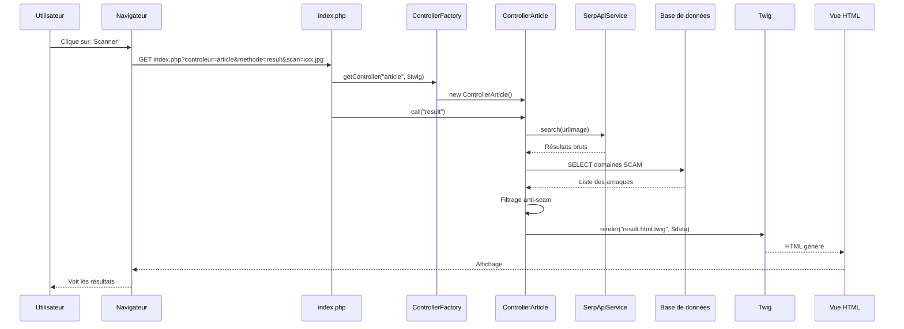

# 🔄 Flux de l'Application SnapFit

> De l'URL à l'affichage des résultats : Explication détaillée du parcours d'une requête.

---

## 📊 Vue d'ensemble (Diagramme)



---

## 🚀 Étape 1 : La Requête HTTP

L'utilisateur clique sur un lien ou soumet un formulaire. Le navigateur envoie une requête :

```
http://npft/SnapFit/index.php?controleur=article&methode=result&scan=scan_696654ae7da96.jpg
```

| Composant | Valeur | Rôle |
|-----------|--------|------|
| `controleur` | `article` | Quel contrôleur utiliser |
| `methode` | `result` | Quelle méthode exécuter |
| `scan` | `scan_xxx.jpg` | Données à traiter |

---

## 📥 Étape 2 : Point d'entrée (`index.php`)

**Le routeur central** - Toutes les requêtes passent ici.

```php
// 1. Chargement des dépendances
require_once 'include.php';   // Autoload, config, session, Twig

// 2. Récupération des paramètres GET
$nomControleur = $_GET['controleur'] ?? '';  // "article"
$nomMethode = $_GET['methode'] ?? '';        // "result"

// 3. Valeurs par défaut (page d'accueil)
if ($nomControleur == '' && $nomMethode == '') {
    $nomControleur = 'home';
    $nomMethode = 'index';
}

// 4. Création du contrôleur via la Factory
$controleur = ControllerFactory::getController($nomControleur, $loader, $twig);

// 5. Appel de la méthode demandée
$controleur->call($nomMethode);
```

**Ce qui se passe concrètement :**
- PHP lit les paramètres de l'URL (`$_GET`)
- Si rien n'est spécifié → page d'accueil
- Sinon → création du bon contrôleur et exécution de la méthode

---

## 🏭 Étape 3 : Factory Pattern (`ControllerFactory`)

**Rôle** : Créer dynamiquement le bon contrôleur sans `if/else` partout.

```php
public static function getController($controleur, $loader, $twig) {
    // 1. Construit le nom de la classe
    $controllerName = "Controller" . ucfirst($controleur);
    // "article" → "ControllerArticle"
    
    // 2. Construit le chemin du fichier
    $fileName = "controller_" . strtolower($controleur) . ".class.php";
    // → "controller_article.class.php"
    
    // 3. Inclut le fichier
    require_once __DIR__ . '/' . $fileName;
    
    // 4. Vérifie que la classe existe
    if (!class_exists($controllerName)) {
        throw new Exception("Le controlleur $controllerName n'existe pas");
    }
    
    // 5. Crée et retourne l'instance
    return new $controllerName($twig, $loader);
}
```

**Avantages du Factory Pattern :**
- Centralise la création des objets
- Facile d'ajouter de nouveaux contrôleurs
- Gestion des erreurs unifiée

---

## 🧠 Étape 4 : Le Contrôleur de Base (`Controller`)

**Classe parente** de tous les contrôleurs. Fournit les outils communs.

```php
class Controller {
    protected PDO $pdo;                              // Connexion BDD
    protected Twig\Environment $twig;                // Moteur de templates
    protected Twig\Loader\FilesystemLoader $loader;  // Chargeur Twig
    protected ?array $get = null;                    // Données $_GET
    protected ?array $post = null;                   // Données $_POST

    public function __construct($twig, $loader) {
        // 1. Connexion à la base de données (Singleton)
        $db = Bd::getInstance();
        $this->pdo = $db->getConnexion();
        
        // 2. Stockage de Twig
        $this->twig = $twig;
        $this->loader = $loader;
        
        // 3. Récupération des paramètres GET/POST
        if (!empty($_GET)) $this->get = $_GET;
        if (!empty($_POST)) $this->post = $_POST;
    }

    // Appel dynamique d'une méthode
    public function call(string $methode): mixed {
        if (!method_exists($this, $methode)) {
            throw new Exception("La méthode $methode n'existe pas");
        }
        return $this->$methode();  // Appel dynamique !
    }
}
```

**Points clés :**
- `$this->$methode()` → **Appel dynamique** de la méthode (ex: `$this->result()`)
- Singleton `Bd::getInstance()` → Une seule connexion BDD pour toute l'application
- Héritage → Tous les contrôleurs ont accès à `$this->pdo`, `$this->twig`, etc.

---

## 🎯 Étape 5 : Le Contrôleur Article (`ControllerArticle::result()`)

C'est ici que **la logique métier** se passe.

```php
public function result() {
    // 1. Récupération du nom de l'image scannée
    $imageScan = $_GET['scan'] ?? null;
    global $config;  // Clé API depuis config_local.yaml
    
    $articles = [];
    $nbBloques = 0;

    if ($imageScan) {
        // 2. Préparation de l'image pour l'API
        $cheminLocal = realpath('public/uploads/' . $imageScan);
        $urlImageApi = $this->uploadToEphemeralHost($cheminLocal);
        
        if ($urlImageApi) {
            // 3. Appel de l'API Google Lens (SerpAPI)
            $service = new SerpApiService($config['api']['serpapi_key']);
            $rawResults = $service->search($urlImageApi);
            
            // 4. Récupération des domaines SCAM depuis la BDD
            $sql = "SELECT url_racine FROM DOMAINE WHERE statut = 'scam'";
            $stmt = $this->pdo->query($sql);
            $scamDomains = $stmt->fetchAll(PDO::FETCH_COLUMN);
            // → ['shein.com', 'temu.com', ...]
            
            // 5. Filtrage des résultats (Anti-Scam)
            foreach ($rawResults as $res) {
                $estScam = false;
                foreach ($scamDomains as $scam) {
                    if (stripos($res['source'], $scam) !== false) {
                        $estScam = true;
                        break;
                    }
                }
                
                if ($estScam) {
                    $nbBloques++;  // Comptabilise
                } else {
                    $articles[] = $res;  // Garde le résultat
                }
            }
        }
        
        // 6. Enregistrement dans l'historique (si connecté)
        if (isset($_SESSION['user_id'])) {
            $rechercheDao = new RechercheDao($this->pdo);
            $recherche = new Recherche($_SESSION['user_id'], $imageScan, 'scan_'.date('YmdHis'));
            $rechercheDao->add($recherche);
        }
    }

    // 7. Rendu de la vue avec les données
    echo $this->twig->render('article/result.html.twig', [
        'scanImage' => $imageScan,
        'articles'  => $articles,
        'nbBloques' => $nbBloques
    ]);
}
```

**Flux de données dans `result()` :**

```
Paramètre GET (scan=xxx.jpg)
        ↓
Upload vers service temporaire (tmpfiles.org)
        ↓
API SerpAPI (Google Lens)
        ↓
Résultats bruts (20-30 articles)
        ↓
Filtrage anti-scam (BDD DOMAINE)
        ↓
Résultats filtrés + compteur bloqués
        ↓
Sauvegarde historique (si connecté)
        ↓
Rendu Twig → HTML final
```

---

## 🎨 Étape 6 : Le Rendu Twig (`result.html.twig`)

Twig transforme les données PHP en HTML.

```twig



    <h1>Résultats de votre scan</h1>
    
    {# Affichage de l'image scannée #}
    
    
    {# Message anti-scam #}
    
        <div class="alert alert-warning">
            ⚠️ {{ nbBloques }} site(s) potentiellement frauduleux masqué(s)
        </div>
    
    
    {# Liste des articles trouvés #}
    
        <div class="card">
            
            <h3>{{ article.title }}</h3>
            <p>{{ article.source }}</p>
            <a href="{{ article.url }}">Voir</a>
        </div>
    

```

**Variables disponibles dans la vue :**
- `scanImage` → Nom du fichier image
- `articles` → Tableau des résultats filtrés
- `nbBloques` → Nombre de sites scam bloqués

---

## 🔁 Résumé du Flux Complet

| Étape | Fichier | Action |
|-------|---------|--------|
| 1 | Navigateur | Envoie `GET /index.php?controleur=article&methode=result&scan=xxx.jpg` |
| 2 | `index.php` | Parse les paramètres, appelle la Factory |
| 3 | `ControllerFactory` | Crée `ControllerArticle` |
| 4 | `Controller` | Initialise PDO, Twig, GET/POST |
| 5 | `ControllerArticle::result()` | Logique métier (API + filtrage + historique) |
| 6 | `SerpApiService` | Appel externe Google Lens |
| 7 | `RechercheDao` | Sauvegarde en BDD |
| 8 | `Twig` | Rendu du template HTML |
| 9 | Navigateur | Affiche la page finale |

---

## 🧩 Design Patterns Utilisés

| Pattern | Où | Pourquoi |
|---------|----|---------| 
| **Front Controller** | `index.php` | Un seul point d'entrée pour toutes les requêtes |
| **Factory** | `ControllerFactory` | Création dynamique des contrôleurs |
| **Singleton** | `Bd::getInstance()` | Une seule connexion BDD partagée |
| **DAO** | `RechercheDao`, `FavoriDao` | Séparation accès données / logique métier |
| **MVC** | Tout le projet | Modèle-Vue-Contrôleur, séparation des responsabilités |

---

## 💡 Points Clés pour la Soutenance

1. **Routage** : `index.php` est le "chef d'orchestre" qui dispatch vers le bon contrôleur
2. **Factory Pattern** : Permet d'ajouter des contrôleurs sans modifier `index.php`
3. **Héritage** : `ControllerArticle extends Controller` pour mutualiser le code
4. **Sécurité** : Filtrage anti-scam côté serveur (pas contournable)
5. **API externe** : Upload temporaire car localhost pas accessible depuis l'extérieur
6. **Twig** : Séparation logique PHP / affichage HTML
